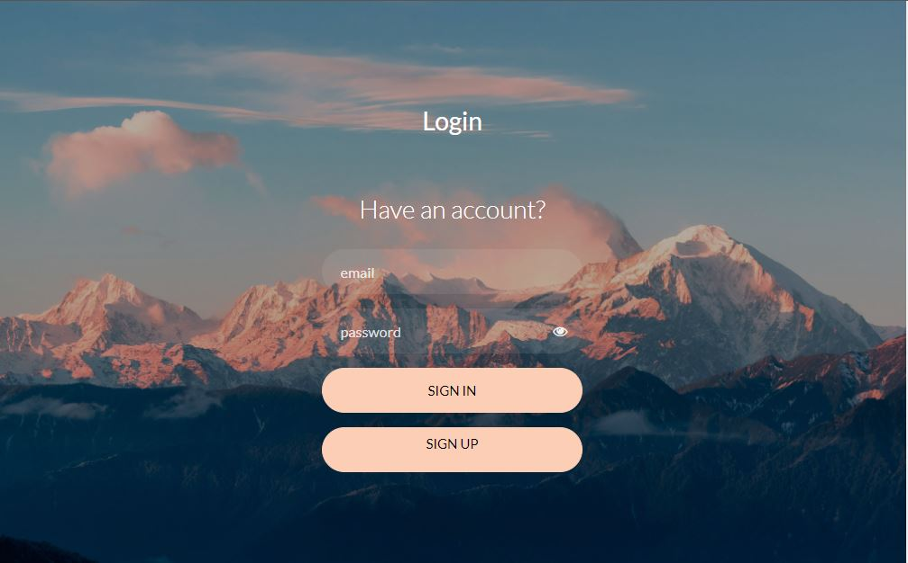
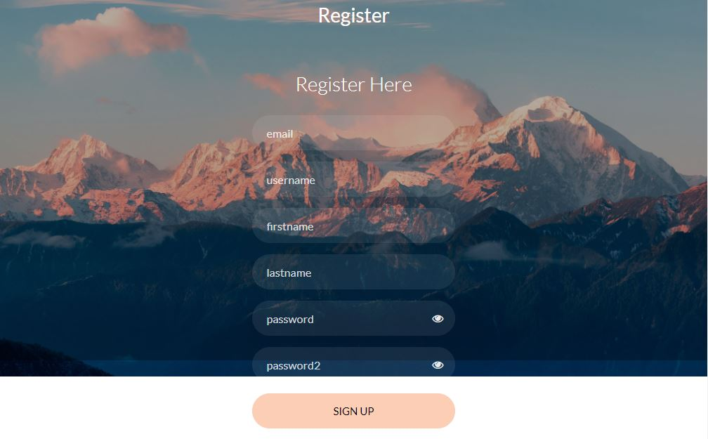

# Project Title

This is a FastAPI based web application that is used to store all your projects.

## Getting Started

These instructions will get you a copy of the project up and running on your local machine for development and testing purposes. See deployment for notes on how to deploy the project on a live system.

### Prerequisites

Make sure you have the following prerequisites installed:
- MySQL [Windows](https://dev.mysql.com/downloads/windows/installer/8.0.html)


```
Give examples
```

### Installing

#### 1. Environment setup.
```commandline
conda create --prefix ./env python=3.7 -y
conda activate ./env
```

#### 2. Install Requirements
```commandline
pip install -r requirements.txt
```
#### 4. Execute this file to generate key for Database

```commandline
python generateKey.py 
```
- After executing this command you will get a secret.key file, now copy the 
secret key and save it into your environment variable as DATABASE_KEY and run this file again to encrypt

- Also add the SECRET_KEY and ALGORITHM to be used to your environment variables

## Docker  Integration 

1. Build Image 
```
docker build -t Image_name .
```
2. Create and run container
```
docker run -p 8000:8080 Image_name
```
3. Stop running container
```
docker stop container_ID
```
4. start container 
```
docker start container_ID
```

## Interface

Login page



Register Page



## Deployment

Add additional notes about how to deploy this on a live system

## Built With

* [FastAPI](https://fastapi.tiangolo.com/) - The web framework used
* [MySQL](https://dev.mysql.com/downloads/windows/) - Database

## Contributing

Please read [CONTRIBUTING.md](https://gist.github.com/PurpleBooth/b24679402957c63ec426) for details on our code of conduct, and the process for submitting pull requests to us.

## Versioning

We use [SemVer](http://semver.org/) for versioning. For the versions available, see the [tags on this repository](https://github.com/your/project/tags). 

## Authors

* **Billie Thompson** - *Initial work* - [PurpleBooth](https://github.com/PurpleBooth)

See also the list of [contributors](https://github.com/your/project/contributors) who participated in this project.

## License

This project is licensed under the MIT License - see the [LICENSE.md](LICENSE.md) file for details

## Acknowledgments

* Hat tip to anyone whose code was used
* Inspiration
* etc

